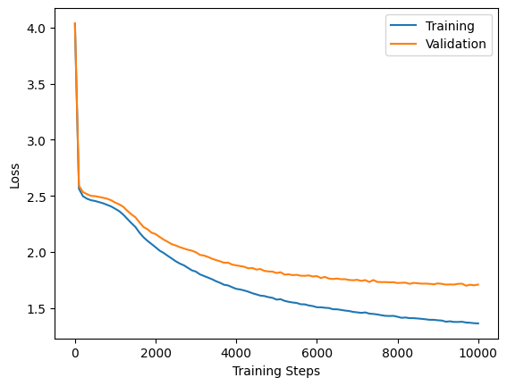

# NanoGPT

Implementation of GPT (decoder-only transformer) based on Andrej Karpathy's model. This model generates Shakespeare-like text.

## Table of Contents

* [Dataset](#dataset)
* [Model](#model)
* [Evaluation](#evaluation)
    * [Loss Curves](#loss-curves)
    * [Generated Samples](#generated-samples)

## Dataset

**Raw Data:** Used [Tiny Shakespeare](https://huggingface.co/datasets/karpathy/tiny_shakespeare) dataset for training the model. \
**Tokenizer:** Tokenized sequences based on characters i.e. each character is an individual token.

## Model

Implemented a decoder-only transformer in PyTorch - the code is present in [nano-gpt.ipynb](./nano-gpt.ipynb). The `TransformerModel` class represents the transformer model with these configurable parameters:

* `block_size` - Similar to sequence length in encoder decoder transformers, it represents the context window for the model.
* `n_embed` - Represents the model dimension d<sub>model</sub>
* `n_heads` - Number of heads to generate for multi head attention (`MultiHeadAttention`)
* `n_layers` - Number of decoder layers to use.
* `dropout` - Dropout value to use wherever required.

Major differences from the original paper:
- **No encoder**: There is no encoder. Each token in the decoder attends only to the preceding tokens.
- **Positional embedding**: Used `nn.Embedding` to learn the positional embeddings instead of using fixed embeddings based on trigonometric functions.
- **Residual Connections**: In residual connections, the `LayerNorm` is applied before the sublayer as opposed to applying it after the sublayer (right before adding). It improves convergence and removes the need for warming up in large models.

## Evaluation

#### Loss Curves

&nbsp;<br>


#### Generated Samples

The generated text does look shakespeare-like but it is not meaningful. That is because of the character based tokenization. Each character in each word itself is generated, which causes the model to generate words that may not exist in the dataset.

```
And they see met, to bring the life; I
And with stand way.

MERCUTIO:
Two of the good! this dost me; your lord bed,
For all wait to hear, answer than hand,
But when raster woulds the way we who weep?
```

```
KING HENRY VITHORK:
It not the ciupand's each off miish?

DUKESS OF YORK:
And what thou never sadom?

VOLUMNIA:
Too.

YORK:
AI will so the such of not or speedishy soul!

Citizens:
If thee to not leave them I bury, and his like,
To this cricks from drops with not be reful die.

DUCHESS OF YORK:
Honow I would yea, here consul find notel.
```

```
KING HENRY VI

GLOUCESTER:
What now you are these with days, ere this
but on the busines and the ose unto him,
Than an thee misjoy tended, servey your horse.

Servant:
It is, all summuch bove a loss in again,
Smew let their to gatest, been with her like,
```